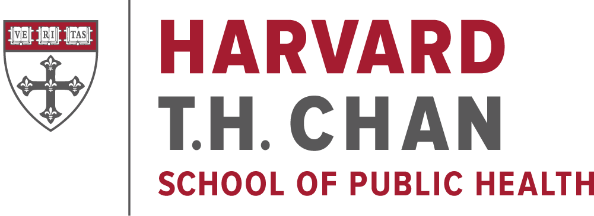
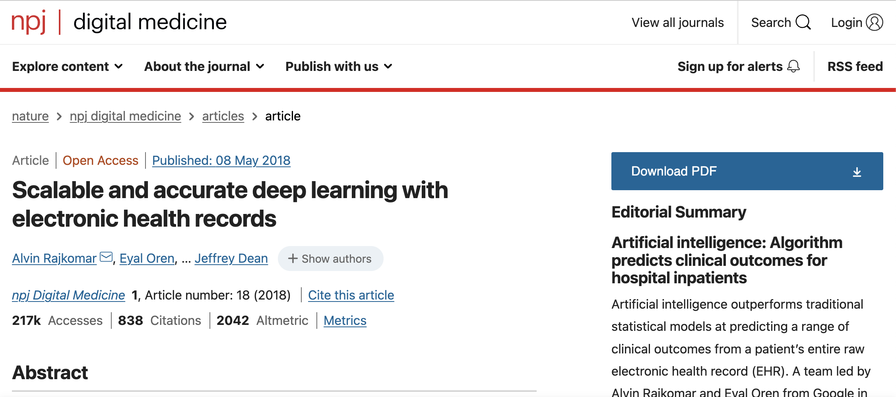
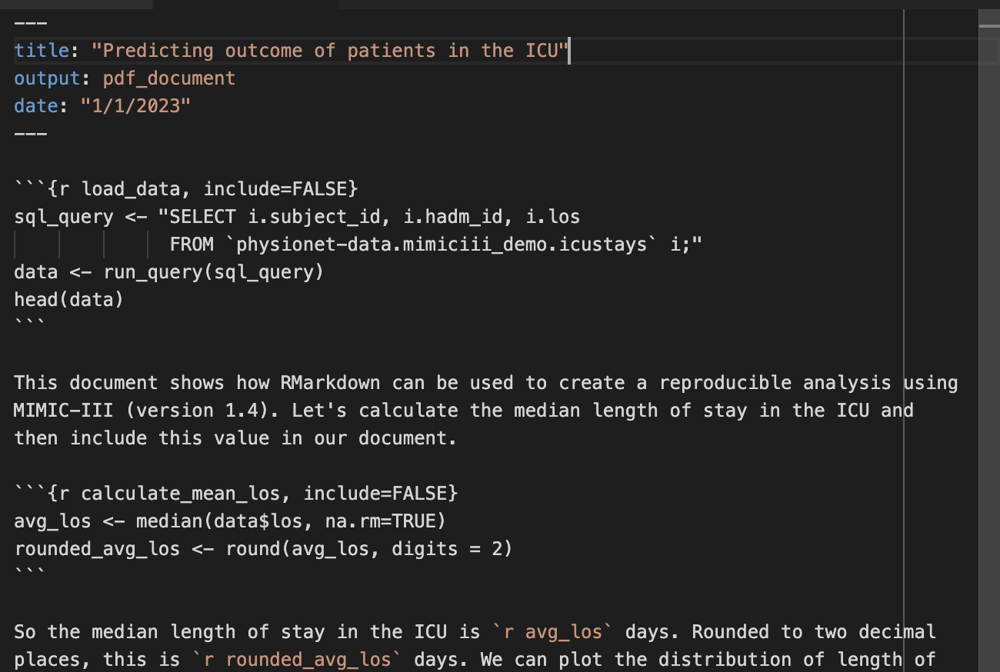
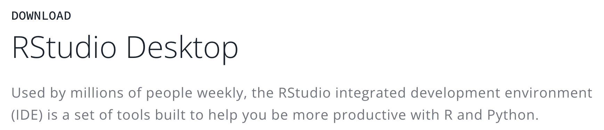
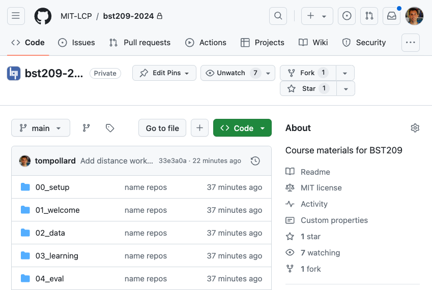
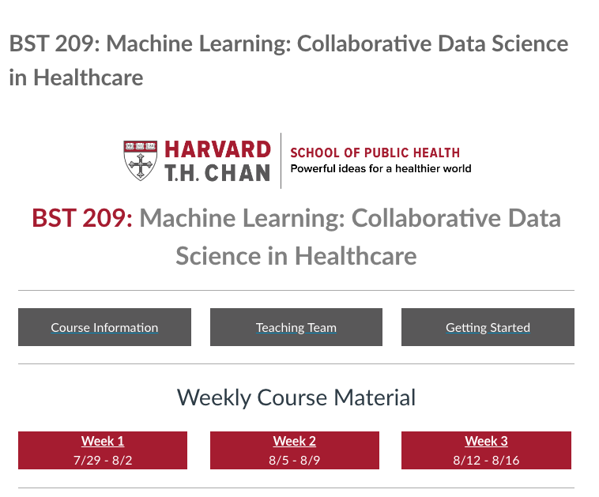

# BST-209: Collaborative Data Science

## Summer Program in Clinical Effectiveness

#### 29 July 2024

 

---

# Teaching team

- Leo Anthony Celi, MD, MS, MPH
- Tom Pollard, PhD
- Chrystinne Fernandes, PhD
- Heather Mattie, PhD
- Fredrik Willumsen Haug (TA)
- Serena Tsai (TA), MD, MS

---

# Become familiar with machine learning concepts

 

<!-- 
Cross-validation
AUROC
Bootstrapping
-->

---

# Get hands-on coding experience

<!-- 

-->

---

# Build teams

<!-- _footer: Photo: 49th Annual Conference of the Society of Critical Care Medicine (SCCM 2020) -->

---

# Schedule

---

# Week 1

- Introduction
- Common concepts in ML
- Regression models and regularization
- Tree models
- Evaluation

---

# Week 2

- Deep Learning
- Large Language Models
- Best practice in ML (TRIPOD-AI and PROBAST+AI)
- Sampling and bias

---

# Week 3

- Bias workshop
- Language models workshop
- Policy Workshop
- Project work and presentations

---

# Presentation

- Propose a project
- 6 minute talk (group, slides)
  - Introduction
  - Goals
  - Data
  - Methods

---

# Final grades:

- Attendance and participation: 60%
- Group presentation 40%

---

# Getting set up

---

---

# RStudio

https://posit.co/download/rstudio-desktop/

---

# Course materials

https://github.com/mit-lcp/bst209-2024

---

# Canvas

https://canvas.harvard.edu/courses/141013/

---

# Questions and comments!
