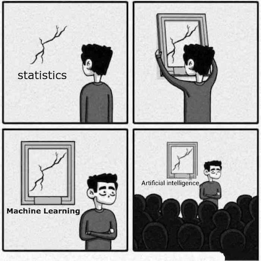

```{r setup, include=FALSE}
knitr::opts_chunk$set(echo = TRUE)
set.seed(1)
library(caret)
library(dslabs)
library(e1071)
library(dplyr)
library(ggplot2)
library(tidyverse)
ds_theme_set()
```

Over the next three weeks, we will explore key concepts in machine learning. Our goal will be to become familiar with the kind of language used in machine learning research, and to build and evaluate machine learning models.

We will be referring to a highly-cited machine learning paper on “Scalable and accurate deep learning with electronic health records” throughout this workshop. You can find the paper here: https://www.nature.com/articles/s41746-018-0029-1

## Rule-based programming

We are all familiar with the idea of applying rules to data to gain insights and make decisions. For example, we learn that human body temperature is ~37 °C (~98.5 °F), and that deviations from this norm can indicate health issues.

If we were developing software to flag patients at risk of deterioration, we might used rule-based programming to create early-warning rules like the one below:

```{r}
# Define our function for detecting fever
has_fever <- function(temp_c) {
    if (temp_c > 38) {
        return(TRUE)
    } else {
        return(FALSE)
    }
}

# Test the function
has_fever(38.5)
```

You could also consider a text classification task where we want to identify if a given text message is spam. In a rule-based approach, we might manually define keywords and patterns to flag spam:

```{r}
# Define our function for detecting spam
is_spam <- function(text) {
    spam_keywords <- c("win", "prize", "free", "click here")
    for (keyword in spam_keywords) {
        if (grepl(keyword, text, ignore.case = TRUE)) {
            return(TRUE)
        }
    }
    return(FALSE)
}

# Test the function
is_spam("Help! I'm stuck in an elevator.")
```

## Machine learning

Machine learning modifies this approach by enabling the creation of rules dynamically based on data. Instead of explicitly coding every rule, we feed data and insights to a machine learning model, which then learns the rules autonomously.

As the volume and complexity of data increase, the model's ability to identify patterns and generate accurate rules also improves, leading to more powerful insights.

In a 2018 paper entitled “Scalable and accurate deep learning with electronic health records”, Rajkomar and colleagues present their work to develop a “deep learning model” (a type of machine learning model) for predicting hospital mortality.

### Exercise:

Read the introduction section of the “Scalable and accurate deep learning with electronic health records” paper by Rajkomar.

A) What is the most time consuming aspect of developing a predictive model, according to the authors?

B) How have “traditional modeling approaches" dealt with high numbers of predictor variables, according to the authors?

### Answers

A) 80% of effort in building models is in “preprocessing, merging, customizing, and cleaning”.

B) Traditional modeling approaches have dealt with complexity by choosing a very limited number of variables to consider.

## Statistics and “AI”

There are ongoing and often polarized debates about the relationship between statistics, machine learning, and “A.I”. Keeping out of the fight, a slightly hand-wavy, non-controversial take might be:

- *Statistics*: A well-established field of mathematics concerned with methods for collecting, analyzing, interpreting and presenting empirical data.
- *Machine learning*: A set of computational methods that learn rules from data, often with the goal of prediction. Borrows from other disciplines, notably statistics and computer science.
- *Deep learning*: A subfield of machine learning that focuses on more complex “artificial neural network” algorithms.
- *Artificial intelligence*: The goal of conferring human-like intelligence to machines. “A.I.” has become popularly used as a synonym for machine learning, so researchers working on the goal of intelligent machines have taken to using “Artificial General Intelligence” (A.G.I.) for clarity.



## Supervised vs unsupervised learning

Over this short course, we will explore key concepts in machine learning. In this introductory lesson we develop and evaluate a simple predictive model, touching on some of the core concepts and techniques that we come across in machine learning projects.

Our goal will be to become familiar with the kind of language used in papers such as “Scalable and accurate deep learning with electronic health records” by Rajkomar and colleagues.

Our focus will be on supervised machine learning, a category of machine learning that involves the use of labelled datasets to train models for classification and prediction. Supervised machine learning can be contrasted to unsupervised machine learning, which attempts to identify meaningful patterns within unlabelled datasets.

### Exercise:

A) We have laboratory test data on patients admitted to a critical care unit and we are trying to identify patients with an emerging, rare disease. There are no labels to indicate which patients have the disease, but we believe that the infected patients will have very distinct characteristics. Should we look for a supervised or unsupervised machine learning approach?

B) We would like to predict whether or not patients will respond to a new drug that is under development based on several genetic markers. We have a large corpus of clinical trial data that includes both genetic markers of patients and their response the new drug. Do we use a supervised or unsupervised approach?

