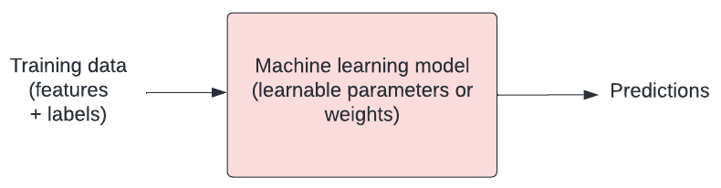

```{r, echo=FALSE, message=FALSE, warning=FALSE}
options(digits=3)
set.seed(1)
library(tidyverse)
library(dslabs)
library(caret)
ds_theme_set()
```

## How do machines learn?

How do humans learn? Typically we are given examples and we learn rules through trial and error. Machines aren't that different! In the context of machine learning, we talk about how a model "fits" to the data.

Our model has a number of tweakable parameters. We need to find the optimal values for those parameters such that our model outputs the "best" predictions for a set of input variables.

.

## Loss functions

Finding the best model means defining "best". We need to have some way of quantifying the difference between a "good" model (capable of making useful predictions) vs a "bad" model (not capable of making useful predictions). 

Loss functions are crucial for doing this. They allow us to quantify how closely our predictions fit to the known target values.  You will hear "objective function", "error function", and "cost function" used in a similar way. 

Mean squared error is a common example of a loss function, often used for linear regression. For each prediction, we measure the distance between the known target value ($y$) and our prediction ($y_{hat}$), and then we take the square.

```{r}
# Load necessary library
library(tidyverse)

# Create sample labeled data
data <- data.frame(x = c(1, 2, 3, 4, 5), y = c(-0.5, 1, 2, 4, 7))

# Add predictions
data$y_hat <- c(0, 2, 4, 6, 8)

# Plot the data
ggplot(data, aes(x = x, y = y)) +
  geom_point() +
  xlim(0, 6) +
  ylim(-1, 9) +
  geom_line(aes(y = y_hat), color = 'blue') +
  geom_segment(aes(x = x, xend = x, y = y, yend = y_hat), color = 'red', linetype = 'dashed') +
  annotate("text", x = 3.1, y = 3, label = "Error") +
  ggtitle("Prediction Error")
```


The further away from the data points our line gets, the bigger the error. Our best model is the one with the smallest error. Mathematically, we can define the mean squared error as:

$$
mse = \frac{1}{n}\sum_{i=1}^{n}(y_{i} - \hat{y}_{i})^{2}
$$

$mse$ is the Mean Squared Error. $y_{i}$ is the actual value and $\hat{y}_{i}$ is the predicted value. $\sum_{}$ is notation to indicate that we are taking the sum of the difference. $n$ is the total number of observations, so $\frac{1}{n}$ indicates that we are taking the mean.

We could implement this in our code as follows:

```{r}
# Define the loss function (mean squared error)
loss <- function(y, y_hat) {
  # Calculate distances
  distances <- y - y_hat
  
  # Calculate squared distances
  squared_distances <- distances^2
  
  # Return mean squared error
  mean(squared_distances)
}

# Example usage
y <- c(-0.5, 1, 2, 4, 7)
y_hat <- c(0, 2, 4, 6, 8)
loss(y, y_hat)
```

## Minimising the error

Our goal is to find the "best" model. We have defined best as being the model with parameters that give us the smallest mean squared error. We can write this as:

$$
argmin\frac{1}{n}\sum_{i=1}^{n}(y_{i} - \hat{y}_{i})^{2}
$$

Let's stop and look at what this loss function means. We'll plot the squared error for a range of values to demonstrate how loss scales as the difference between $y$ and $\hat{y}$ increases.

```{r}
# Load necessary library
library(ggplot2)

# Generate data
x <- seq(-50, 50, 0.05)
y <- x^2

# Create the plot
ggplot(data = data.frame(x, y), aes(x = x, y = y)) +
  geom_line() +
  labs(
    x = "Difference between y and y_hat",
    y = "Loss (squared error)",
    title = "Loss Function Visualization"
  )
```

As we can see, our loss rapidly increases as predictions ($\hat{y}$) move away from the true values ($y$). The result is that outliers have a strong influence on our model fit. 

## Optimisation

In machine learning, there is typically a training step where an algorithm is used to find the optimal set of model parameters (i.e. those parameters that give the minimum possible error). This is the essence of machine learning!

There are many approaches to optimisation. [Gradient descent](https://en.wikipedia.org/wiki/Gradient_descent) is a popular approach. In gradient descent we take steps in the opposite direction of the gradient of a function, seeking the lowest point (i.e. the lowest error). A learning rate allows us to define how large steps to take.

### Example of Gradient Descent

Here’s a simple example of gradient descent to minimize a quadratic function, where: 

- `f` is the function we want to minimize.
- `f_prime` is the gradient of the function.
- `gradient_descent` is the algorithm that updates x by taking steps proportional to the negative of the gradient.
- The `learning_rate` controls the size of each step, and `n_iterations` is the number of iterations to run the algorithm.
- `optimal_x` will hold the value of x that minimizes the function.

```{r}
# Define the quadratic function
f <- function(x) { x^2 + 3*x + 2 }

# Define the gradient (derivative) of the function
f_prime <- function(x) { 2*x + 3 }

# Gradient Descent algorithm
gradient_descent <- function(f_prime, initial_x, learning_rate, n_iterations) {
  x <- initial_x
  for (i in 1:n_iterations) {
    x <- x - learning_rate * f_prime(x)
  }
  return(x)
}

# Parameters
initial_x <- 0
learning_rate <- 0.1
n_iterations <- 100

# Run Gradient Descent
optimal_x <- gradient_descent(f_prime, initial_x, learning_rate, n_iterations)
optimal_x
```

## Exercise

A) What does a loss function quantify?  
B) What is an example of a loss function?   
C) What are some other names used for loss functions?  
D) What is happening when a model is trained?  

## Solution

A loss function quantifies the goodness of fit of a model (i.e. how closely its predictions match the known targets).  
B) One example of a loss function is mean squared error (M.S.E.).  
C) Objective function, error function, and cost function.  
D) When a model is trained, we are attempting to find the optimal model parameters in process known as "optimisation".

## What's next?

Now that we’ve touched on how machines learn, we’ll tackle the problem of predicting the outcome of patients admitted to intensive care units in hospitals across the United States.
