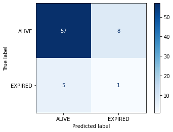

```{r, echo=FALSE, message=FALSE, warnings=FALSE}
set.seed(1)
library(tidyverse)
library(caret)
library(dplyr)
library(pROC)
```

## Evaluating a classification task

We trained a machine learning model to predict the outcome of patients admitted to intensive care units. As there are two outcomes, we refer to this as a "binary" classification task. We are now ready to evaluate the model on our held-out test set. 

Let's load the data and select our feature/s.

```{r load_data}
# Load the data
cohort <- read.csv("./eicu_cohort.csv")
features = c("apachescore")
```

Next, create our training and test sets:

```{r split_data}
# Split the data into training and testing sets
train_index <- createDataPartition(cohort$apachescore, times = 1, p = 0.7, list = FALSE)
train_set <- cohort[train_index, ]
test_set <- cohort[-train_index, ]
```

Train (/fit) our model on the training set:

```{r fit_model}
# Fit the logistic regression model
log_model <- glm(actualhospitalmortality ~ apachescore, data = train_set, family = binomial)
```

Now predict outcomes of patients in the test set:

```{r predict}
# Generate predictions (and print the first 10 predictions)
y_hat_test_prob <- predict(log_model, test_set[features], type="response")

# Round the probabilities to give 0 and 1 predictions (on 50% threshold)
y_hat_test_class = round(y_hat_test_prob,0)
y_hat_test_prob[1:10]
```

Each prediction is assigned a probability of a positive class. For example, the first 10 probabilities are:

```{r predicted_classes}
print(y_hat_test_class[1:10])
```

These probabilities correspond to the following predictions, either a "0" ("ALIVE") or a 1 ("DECEASED"):

By comparing the predictions with known outcomes, we can put each prediction into one of the following categories:

- True positive: we predict "1" ("DECEASED") and the true outcome is "1".
- True negative: we predict "0" ("ALIVE") and the true outcome is "0".
- False positive: we predict "1" ("DECEASED") and the true outcome is "0".
- False negative: we predict "0" ("ALIVE") and the true outcome is "1".

## Confusion matrices

It is common practice to arrange these outcome categories into a "confusion matrix", which is a grid that records our predictions against the ground truth. For a binary outcome, confusion matrices are organised as follows:

|                        | Negative (predicted)   | Positive  (predicted) |
| :---                   | :----:                 | :----:                |
| Negative (actual)      | **TN**                 | FP                    |
| Positive (actual)      | FN                     | **TP**                |

The sum of the cells is the total number of predictions. The diagonal from top left to bottom right indicates correct predictions. Let's visualize the results of the model in the form of a confusion matrix:

```{r generate_matrix}
# Generate the confusion matrix
confusion <- confusionMatrix(as.factor(y_hat_test_class),
                             as.factor(test_set$actualhospitalmortality))

# Print the confusion matrix
print(confusion$table)
```

{: width="600px"}

We have two columns and rows because we have a binary outcome, but you can also extend the matrix to plot multi-class classification predictions. If we had more output classes, the number of columns and rows would match the number of classes.

## Exercises
A. How many false positives are there?

B. How many false negatives are there?

C. How many true positives are there?

D. How many true negatives are there?

## Solutions
Be careful! The printed table is organized differently than the one we wrote showing TN, FN, TP, FP!

A. 0

B. 14

C. 4

D. 141

## Accuracy

Accuracy is the overall proportion of correct predictions. Think of a dartboard. How many shots did we take? How many did we hit? Divide one by the other and that's the accuracy. 

Accuracy can be written as:

$$
Accuracy = \frac{TP+TN}{TP+TN+FP+FN}
$$

What was the accuracy of our model? 

```{r report_accuracy}
accuracy <- confusion$overall['Accuracy']
cat(sprintf("Accuracy (model) = %.2f\n", accuracy))
```

Not bad at first glance. When comparing our performance to guessing "0" for every patient, however, it seems slightly less impressive!

```{r predict_zeros}
# Create a vector of zeros with the same length as the test set
zeros <- rep(0, length(test_set$actualhospitalmortality))
zeros_factor <- factor(zeros, levels = c(0, 1))

# Calculate accuracy
confusion_zeros <- confusionMatrix(zeros_factor, as.factor(test_set$actualhospitalmortality))
accuracy_zeros <- confusion_zeros$overall['Accuracy']

# Print the accuracy
cat(sprintf("Accuracy (zeros) = %.2f\n", accuracy_zeros))
```

The problem with accuracy as a metric is that it is heavily influenced by prevalence of the positive outcome: because the proportion of 1s is relatively low, classifying everything as 0 is a safe bet.

We can see that the high accuracy is possible despite totally missing our target. To evaluate an algorithm in a way that prevalence does not cloud our assessment, we often look at sensitivity and specificity. 

## Sensitivity (A.K.A "Recall" and "True Positive Rate")

Sensitivity is the ability of an algorithm to predict a positive outcome when the actual outcome is positive. In our case, of the patients who die, what proportion did we correctly predict? This can be written as:

$$
Sensitivity = Recall = \frac{TP}{TP+FN}
$$

If sensitivity is high, the model is good at identifying all the actual positives.

Because a model that calls "1" for everything has perfect sensitivity, this measure is not enough on its own. Alongside sensitivity we often report on specificity.

## Specificity (A.K.A "True Negative Rate")

Specificity measures the proportion of actual negative cases (e.g., patients who survive their stay) that the model correctly identifies. The formula for specificity is:

$$
Specificity = \frac{TN}{FP+TN}
$$

If specificity is high, the model is good at identifying all the actual negatives. In a medical test, if a test has high specificity, it means it can correctly identify most of the patients who do not have the disease.

## Precision (A.K.A "Positive Predictive Value")

Precision is the ratio of true positive predictions to the total number of positive predictions made by the model. In our case, it tells us how many of the patients we predicted would die actually died. The formula for precision is:

$$
Precision = \frac{TP}{TP+FP}
$$

A high precision indicates that most of the positive predictions made by the model are correct, which is important in situations where false positives carry a significant cost or consequence.

(Specificity is about correctly identifying negatives, whereas precision concerns the correctness of positive predictions).

## F1 Score

The F1 score is a metric that combines precision and recall to give a single score. It is the harmonic mean of precision and recall and is given by the formula:

$$
F1 = 2 \times \frac{{\text{Precision} \times \text{Recall}}}{{\text{Precision} + \text{Recall}}}
$$

## Receiver-Operator Characteristic

A Receiver-Operator Characteristic (ROC) curve plots 1 - specificity vs. sensitivity at varying probability thresholds. The area under this curve is known as the AUROC (or sometimes just the "Area Under the Curve", AUC) and it is a well-used measure of discrimination that was originally developed by radar operators in the 1940s.

```{r plot_roc}
# Create the ROC curve
roc_curve <- roc(test_set$actualhospitalmortality, y_hat_test_prob)

# Plot the ROC curve
plot(roc_curve,
     main = "ROC Curve",
     col = "#1c61b6",
     print.auc = TRUE,
     grid = TRUE,
     xlim = c(1, 0),
     ylim = c(0, 1),
     xlab = "1 - Specificity",
     ylab = "Sensitivity")
```

## Area Under the Precision-Recall Curve (AUPRC)

The AUPRC curve is also often used to evaluate performance, often as an attempt to address issues around class imbalance. If you are interested in exploring AUPRC and AUROC in detail, we suggest reading "Closer Look at AUROC and AUPRC under Class Imbalance" by McDermott et al. (https://arxiv.org/abs/2401.06091).
The abstract is reproduced below:

> In machine learning (ML), a widespread adage is that the area under the precision-recall curve (AUPRC) is a superior metric for model comparison to the area under the receiver operating characteristic (AUROC) for binary classification tasks with class imbalance. This paper challenges this notion through novel mathematical analysis, illustrating that AUROC and AUPRC can be concisely related in probabilistic terms. *We demonstrate that AUPRC, contrary to popular belief, is not superior in cases of class imbalance and might even be a harmful metric, given its inclination to unduly favor model improvements in subpopulations with more frequent positive labels.* This bias can inadvertently heighten algorithmic disparities. Prompted by these insights, a thorough review of existing ML literature was conducted, utilizing large language models to analyze over 1.5 million papers from arXiv. Our investigation focused on the prevalence and substantiation of the purported AUPRC superiority. The results expose a significant deficit in empirical backing and a trend of misattributions that have fuelled the widespread acceptance of AUPRC's supposed advantages. Our findings represent a dual contribution: a significant technical advancement in understanding metric behaviors and a stark warning about unchecked assumptions in the ML community. 


