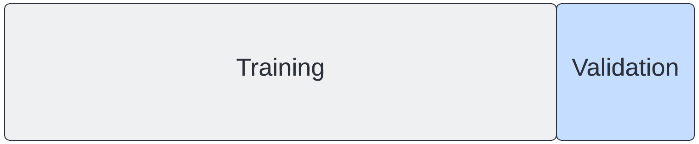

```{r, echo=FALSE, message=FALSE, warnings=FALSE}
set.seed(1)
library(tidyverse)
library(caret)
library(dplyr)
library(tidymodels)
```

## Accuracy

One measure of the performance of a classification model is accuracy. Accuracy is defined as the overall proportion of correct predictions. If, for example, we take 50 shots and 40 of them hit the target, then our accuracy is 0.8 (40/50).


Accuracy can therefore be defined by the formula below:

$$ Accuracy = \frac{Correct\ predictions}{All\ predictions}$$

What is the accuracy of our model at predicting in-hospital mortality?

```{r load_data}
set.seed(1)

# Load the data
cohort <- read_csv("./eicu_cohort.csv", show_col_types = FALSE)
features = c("apachescore")
```

Split the data into training and test sets:

```{r}
# Split the data into training and testing sets
train_index <- createDataPartition(cohort$apachescore, times = 1, p = 0.7, list = FALSE)
train_set <- cohort[train_index, ]
test_set <- cohort[-train_index, ]
```

Fit our model to the training set:

```{r}
# Fit the logistic regression model
log_model <- glm(actualhospitalmortality ~ apachescore, data = train_set, family = binomial)
```

Generate the predictions:

```{r}
# generate predictions
y_hat_train = predict(log_model, train_set[features], type="response")
y_hat_test = predict(log_model, test_set[features], type="response")

# Convert probabilities to class labels (assuming binary classification with threshold 0.5)
y_hat_train_class <- ifelse(y_hat_train > 0.5, 1, 0)
y_hat_test_class <- ifelse(y_hat_test > 0.5, 1, 0)
```

Compute accuracy on the training and test sets:

```{r}
# Accuracy on training set
acc_train <- mean(y_hat_train_class == train_set$actualhospitalmortality)
cat(sprintf("Accuracy on training set: %.2f\n", acc_train))

# Accuracy on test set
acc_test <- mean(y_hat_test_class == test_set$actualhospitalmortality)
cat(sprintf("Accuracy on test set: %.2f\n", acc_test))
```

Not bad! There was a slight drop in performance on our test set, but that is to be expected.

## Validation set

Machine learning is iterative by nature. We want to improve our model, tuning and evaluating as we go. This leads us to a problem. Using our test set to iteratively improve our model would be cheating. It is supposed to be "held out", not used for training! So what do we do?

The answer is that we typically partition off part of our training set to use for validation. The "validation set" can be used to iteratively improve our model, allowing us to save our test set for the \*final\* evaluation.



## Cross validation

Why stop at one validation set? With sampling, we can create many training sets and many validation sets, each slightly different. We can then average our findings over the partitions to give an estimate of the model's predictive performance

The family of resampling methods used for this is known as "cross validation". It turns out that one major benefit to cross validation is that it helps us to build more robust models. 

If we train our model on a single set of data, the model may learn rules that are overly specific (e.g. "all patients aged 63 years survive"). These rules will not generalise well to unseen data. When this happens, we say our model is "overfitted".

If we train on multiple, subtly-different versions of the data, we can identify rules that are likely to generalise better outside out training set, helping to avoid overfitting.

Two popular of the most popular cross-validation methods:

- K-fold cross validation
- Leave-one-out cross validation

## K-fold cross validation

In K-fold cross validation, "K" indicates the number of times we split our data into training/validation sets. With 5-fold cross validation, for example, we create 5 separate training/validation sets.


With K-fold cross validation, we select our model to evaluate and then:

1. Partition the training data into a training set and a validation set. An 80%, 20% split is common.
2. Fit the model to the training set and make a record of the optimal parameters.
3. Evaluate performance on the validation set.
4. Repeat the process 5 times, then average the parameter and performance values.

When creating our training and test sets, we needed to be careful to avoid data leaks. The same applies when creating training and validation sets. We can use `workflows` to help manage this issue (see: https://workflows.tidymodels.org/).

> "A workflow is an object that can bundle together your pre-processing, modeling, and post-processing requests."

```{r}
# Define the recipe for preprocessing
recipe <- recipe(actualhospitalmortality ~ apachescore, data = train_set) %>%
  step_mutate(actualhospitalmortality = as.factor(actualhospitalmortality)) %>% 
  step_normalize(all_predictors())

# Define the logistic regression model
model <- logistic_reg() %>% 
  set_engine("glm")

# Combine the recipe and model into a workflow
workflow <- workflow() %>%
  add_recipe(recipe) %>%
  add_model(model)

# Define the cross-validation procedure
set.seed(1)
n_folds <- 5
n_repeats <- 3
cv <- vfold_cv(train_set,
               v = n_folds,
               repeats = n_repeats,
               strata = actualhospitalmortality)
```

We can now evaluate our model using the workflow:

```{r}
# Evaluate the model using cross-validation
results <- workflow %>%
  fit_resamples(cv, metrics = metric_set(accuracy))

# Extract the metrics from the results
metrics <- results %>%
  collect_metrics() %>%
  filter(.metric == "accuracy")

# Calculate the number of folds and repeats
n <- n_folds * n_repeats

# Check the content of the metrics
str(metrics)

# Summarize performance
mean_accuracy <- mean(metrics$mean)
std_error <- metrics$std_err

# Calculate standard deviation from standard error
std_deviation <- std_error * sqrt(n)

# Report performance
cat(sprintf('Cross-validation accuracy, mean (std): %.2f (%.2f)\n', mean_accuracy, std_deviation))
```

Leave-one-out cross validation is the same idea, except that we have many more folds. In fact, we have one fold for each data point. Each fold we leave out one data point for validation and use all of the other points for training.

