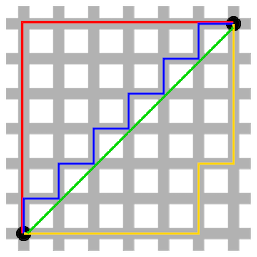

```{r, echo=FALSE, message=FALSE, warning=FALSE}
options(digits=3)
set.seed(1)
library(tidyverse)
library(caret)
library(dplyr)
library(dslabs)
library(rafalib)
ds_theme_set()
```

In this lesson, we will explore the concept of distance in the context of machine learning, and how it applies to building models with multiple predictors. 

Distance measures play an important role in machine learning. A distance measure is an objective score that summarizes the relative difference between two objects. Most commonly, the two objects are rows of data that describe a subject (such as a person), or an event (such as a purchase, a claim, or a diagnosis).

Many of the analyses we perform with high-dimensional data relate directly or indirectly to distance. Many clustering and machine learning techniques rely on being able to define distance, using features or predictors. 

## Euclidean Distance

In machine learning and data analysis, various distance metrics are used depending on the nature of the data and the problem at hand. Euclidean distance is the most common, and most likely the most familiar to you too.

As a review, let's define the distance between two points, $A$ and $B$, on a Cartesian plane.

```{r,echo=FALSE,fig.cap=""}
# Set up plotting parameters
mypar()

# Create the plot
plot(c(0,1,1),c(0,0,1), pch=16, cex=2, xaxt="n", yaxt="n", xlab="", ylab="", bty="n", xlim=c(-0.25,1.25), ylim=c(-0.25,1.25))
lines(c(0,1,1,0), c(0,0,1,0))

# Add text annotations
text(0,.2,expression(paste('(A'[x]*',A'[y]*')')),cex=1.5)
text(1,1.2,expression(paste('(B'[x]*',B'[y]*')')),cex=1.5)
text(-0.1,0,"A",cex=2)
text(1.1,1,"B",cex=2)
```

The euclidean distance between $A$ and $B$ is:

$$\sqrt{ (A_x-B_x)^2 + (A_y-B_y)^2}$$

## K-means clustering

An example of a machine learning algorithm that makes use of distance very directly is K-Means clustering. The K-means algorithm can be used to partition a dataset into distinct groups, or clusters. 

The algorithm aims to minimize the distance between points within each cluster and their respective centroids, effectively grouping similar points together.

### How K-means works

1. Initialization: Choose the number of clusters ($K$) and randomly select ($K$) data points as initial centroids.
2. Assignment: Assign each data point to the nearest centroid based on Euclidean distance.
3. Update: Calculate new centroids as the mean of all points assigned to each cluster.
Iteration: Repeat the assignment and update steps until the centroids no longer change significantly or a maximum number of iterations is reached.

### Example: Clustering Heart Rates of Adults and Pediatric Patients

We will create a bimodal distribution representing heart rates of adults and pediatric patients and apply K-Means clustering to identify the two distinct groups.

```{r}
# Set seed for reproducibility
set.seed(123)

# Generate heart rate data for adults
adult_heart_rates <- rnorm(200, mean = 70, sd = 10)

# Generate heart rate data for pediatric patients
pediatric_heart_rates <- rnorm(200, mean = 110, sd = 15)

# Combine the two datasets to create a bimodal distribution
heart_rate_data <- tibble(heart_rate = c(adult_heart_rates, pediatric_heart_rates))

# Visualize the data
ggplot(heart_rate_data, aes(x = heart_rate)) +
  geom_histogram(binwidth = 5, fill = "blue", color = "black") +
  labs(title = "Heart Rate Data (Bimodal Distribution)", x = "Heart Rate", y = "Frequency")

# Apply K-means clustering with 2 clusters
kmeans_result <- kmeans(heart_rate_data, centers = 2, nstart = 20)

# Add the cluster assignments to the original data
heart_rate_data <- heart_rate_data %>% mutate(cluster = factor(kmeans_result$cluster))

# Visualize the clustered data
ggplot(heart_rate_data, aes(x = heart_rate, fill = cluster)) +
  geom_histogram(binwidth = 5, color = "black", position = "dodge") +
  labs(title = "K-Means Clustering of Heart Rates", x = "Heart Rate", y = "Frequency", fill = "Cluster")
```

While we explicitly stated a value for $K$ in this example, there are several methods that are used to automatically determine the number of clusters. We won't explore those methods here, but you can find plenty of resources on the web if you would like to do a deeper dive.

## Manhattan ("Taxicab") distance

Note that Euclidean distance isn't the only measure of distance, and often our choice of distance metric is an important consideration in the modelling process.

Another common measure of distance is the Manhattan distance, which measures the sum of the absolute differences between the coordinates of two points. 

Conceptually, you can think of Manhattan distance as the route your taxi would take through grid-based systems like city blocks.



We will learn more about the use cases for Euclidean and Manhattan distances later, when we explore regularization. The Manhattan distance is the concept behind the L1 norm (also known as the Manhattan norm or Taxicab norm) and the L2 norm is also known as the Euclidean norm.


## k Nearest Neighbors

K-nearest neighbors (kNN) is another clustering algorithm. We first define the distance between all observations based on the features (covariates). Basically, for any point $\bf{x}$ for which we want an estimate of $p(\bf{x})$, we look for the $k$ nearest points and then take an average of these points. This gives us an estimate of $p(x_1,x_2)$. We can now control flexibility through $k$. 

Let's add a predictor to our model - `admissionweight`.

```{r load_data}
# Load the data
cohort <- read.csv("./eicu_cohort.csv")
features = c("apachescore", "heartrate")
```

Next, create our training and test sets:

```{r split_data}
# Split the data into training and testing sets
set.seed(50)
train_index <- createDataPartition(cohort$apachescore, times = 1, p = 0.7, list = FALSE)
train_set <- cohort[train_index, ]
test_set <- cohort[-train_index, ]
```

Let's use a logistic regression model as a baseline. Train (/fit) the model on the training set:

```{r fit_model}
# Fit the k regression model
log_model <- glm(actualhospitalmortality ~ apachescore + heartrate, data = train_set, family = binomial)
```

Now predict outcomes of patients in the test set:

```{r predict}
# Generate predictions (and print the first 10 predictions)
y_hat_test_prob <- predict(log_model, test_set[features], type="response")

# Round the probabilities to give 0 and 1 predictions (on 50% threshold)
y_hat_test_class = round(y_hat_test_prob,0)
```

Now, lets compare to kNN. Let's start with the default $k = 5$

```{r}
knn_model <- knn3(actualhospitalmortality ~ apachescore + heartrate, data = train_set)
f_hat <- predict(knn_model, newdata = test_set)[,2]
tab <- table(pred = round(f_hat), truth = test_set$actualhospitalmortality)
confusionMatrix(tab)$tab
confusionMatrix(tab)$overall["Accuracy"]
```

```{r, echo=FALSE, fig.width=10.5,fig.height=5.25, fig.align="center", message = FALSE, warning=FALSE}
# Define the range for apache score and heartrate
x_range <- seq(0, 225, length.out = 200)
y_range <- seq(0, 200, length.out = 200)

# Create the grid of values
p_x <- expand.grid(apachescore = x_range, heartrate = y_range)

f_hat <- predict(knn_model, newdata = p_x)[,2]
g1 <- p_x %>% mutate(f_hat = f_hat) %>%
  ggplot(aes(apachescore, heartrate, fill = f_hat))  +
  scale_fill_gradientn(colors=c("#F8766D","white","#00BFC4")) + 
  geom_raster() + 
  guides(fill=FALSE) +  
  stat_contour(aes(x=apachescore,y=heartrate,z=f_hat),data=p_x, breaks=c(0.5),color="black",lwd=1.5)


g2 <- ggplot(p_x) +
  geom_point(data=train_set, aes(x=apachescore, y=heartrate, fill=as.factor(actualhospitalmortality)), pch=21) + 
  stat_contour(aes(x=apachescore, y=heartrate,z=f_hat), breaks=c(0.5),color="black",lwd=1.5) +
  guides(fill=guide_legend(title="Mortality"))

library(gridExtra)
grid.arrange(g1,g2, nrow=1)
``` 


When $k=5$, we see some islands of blue in the red area. This is due to what we call _over training_ or _overfitting_. Note that we have higher accuracy in the train set compared to the test set:

```{r}
f_hat <- predict(knn_model, newdata = test_set)[,2]
tab <- table(pred = round(f_hat), truth = test_set$actualhospitalmortality)
confusionMatrix(tab)$overall["Accuracy"]

f_hat_train <- predict(knn_model, newdata = train_set)[,2]
tab <- table(pred = round(f_hat_train), truth=train_set$actualhospitalmortality)
confusionMatrix(tab)$overall["Accuracy"]
```


## Overfitting

Overfitting is at its worse when we set $k = 1$. In this case we will obtain nearly perfect accuracy in the training set because each point is used to predict itself. So perfect accuracy must happen by definition. However, the test set accuracy is actually worse than logistic regression.

```{r}
knn_fit_1 <- knn3(actualhospitalmortality ~ apachescore + heartrate, data = train_set, k=1)

f_hat <- predict(knn_fit_1, newdata = train_set)[,2]
tab <- table(pred = round(f_hat), truth = train_set$actualhospitalmortality)
confusionMatrix(tab)$overall["Accuracy"]

f_hat <- predict(knn_fit_1, newdata = test_set)[,2]
tab <- table(pred = round(f_hat), truth = test_set$actualhospitalmortality)
confusionMatrix(tab)$overall["Accuracy"]
```

We can see the overfitting problem in this figure:

```{r, echo=FALSE, fig.width=10.5,fig.height=5.25, fig.align="center", warning=FALSE}
f_hat <- predict(knn_fit_1, newdata = p_x)[,2]
g1 <- p_x %>% mutate(f_hat = f_hat) %>%
  ggplot(aes(apachescore, heartrate, fill = f_hat))  +
  scale_fill_gradientn(colors=c("#F8766D","white","#00BFC4")) + geom_raster() +
  guides(fill=FALSE) +  
  stat_contour(aes(x=apachescore,y=heartrate,z=f_hat),data=p_x,breaks=c(0.5),color="black",lwd=1.5)

g2 <- ggplot(p_x) +  
  geom_point(data=train_set, aes(x=apachescore, y=heartrate, fill=as.factor(actualhospitalmortality)),  pch=21) + 
  stat_contour(aes(apachescore,heartrate,z=f_hat), breaks=c(0.5),color="black",lwd=1.5) +
  guides(fill=guide_legend(title="Mortality"))
  
library(gridExtra)
grid.arrange(g1,g2, nrow=1)
``` 

We can also underfit our model. Look at what happens with 50 closest neighbors:

```{r}
knn_fit_17 <- knn3(actualhospitalmortality ~ apachescore + heartrate, data = train_set, k=17)

f_hat <- predict(knn_fit_17, newdata = test_set)[,2]
tab <- table(pred = round(f_hat), truth = as.factor(test_set$actualhospitalmortality))
confusionMatrix(tab)$overall["Accuracy"]
```

This turns out to be similar to logistic regression:
```{r, echo=FALSE, fig.width=10.5,fig.height=5.25, fig.align="center", warning=FALSE}
f_hat <- predict(knn_fit_17, newdata = p_x)[,2]
g1 <- p_x %>% mutate(f_hat = f_hat) %>%
  ggplot(aes(apachescore, heartrate, fill = f_hat))  +
  scale_fill_gradientn(colors=c("#F8766D","white","#00BFC4")) + geom_raster() +
  guides(fill=FALSE) +  
  stat_contour(aes(x=apachescore,y=heartrate,z=f_hat),data=p_x,breaks=c(0.5),color="black",lwd=1.5)

g2 <- ggplot(p_x) +  
  geom_point(data=train_set, aes(x=apachescore, y=heartrate, fill=as.factor(actualhospitalmortality)),  pch=21) + 
  stat_contour(aes(apachescore,heartrate,z=f_hat), breaks=c(0.5),color="black",lwd=1.5) +
  guides(fill=guide_legend(title="Mortality"))
  
library(gridExtra)
grid.arrange(g1,g2, nrow=1)
``` 

Let's plot the accuracy for different numbers of closest neighbors.
```{r}
control <- trainControl(method = 'cv', number = 2, p = 0.5)
dat2 <- mutate(cohort, label=as.factor(actualhospitalmortality)) %>%
  select(label,apachescore,heartrate)
res <- train(label ~ .,
             data = dat2,
             method = "knn",
             trControl = control,
             tuneLength = 1, # How fine a mesh to go on grid
             tuneGrid=data.frame(k=seq(1,17)),
             metric="Accuracy")
plot(res)
```

With $k = 7$ we obtain what appears to be a decent estimate of the true $f$.

```{r, echo=FALSE, fig.width=10.5,fig.height=5.25, fig.align="center", warning=FALSE}
knn_fit_7 <- knn3(actualhospitalmortality ~ apachescore + heartrate, data = train_set, k=7)
f_hat <- predict(knn_fit_7, newdata = p_x)[,2]

g1 <- p_x %>% mutate(f_hat = f_hat) %>%
  ggplot(aes(apachescore, heartrate, fill = f_hat))  +
  scale_fill_gradientn(colors=c("#F8766D","white","#00BFC4")) + 
  geom_raster() +
  guides(fill=FALSE) +  
  stat_contour(aes(x=apachescore,y=heartrate,z=f_hat),data=p_x, breaks=c(0.5),color="black",lwd=1.5)

g2 <- ggplot(p_x) +  
  geom_point(data=train_set, aes(apachescore, heartrate, fill = as.factor(actualhospitalmortality)),pch=21) +
  stat_contour(aes(x=apachescore,y=heartrate,z=f_hat), breaks=c(0.5),color="black",lwd=1.5) +
  guides(fill=guide_legend(title="Mortality"))
 
library(gridExtra)
grid.arrange(g1,g2, nrow=1)  
``` 


```{r}
f_hat <- predict(knn_fit_7, newdata = test_set)[,2]
tab <- table(pred = round(f_hat), truth = test_set$actualhospitalmortality)
confusionMatrix(tab)$overall["Accuracy"]
```


