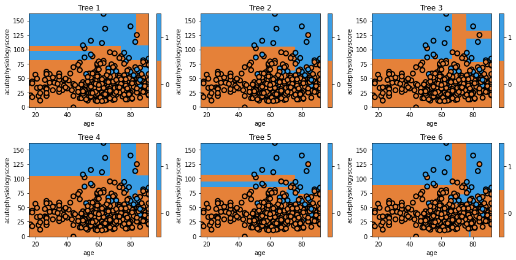

```{r, echo=FALSE, message=FALSE, warnings=FALSE}
library(tidyverse)
library(caret)
library(dplyr)
library(rafalib)
library(ggplot2)
library(gridExtra)
library(rpart)
library(rpart.plot)
library(rpart)
library(ipred)
library(randomForest)
```

```{r custom_plot, echo=FALSE}
# Custom plotting function
# This function is reused in each workshop
plot_model_pred_2d <- function(model, dataset, feature1, feature2, target, title, min_f1, max_f1, min_f2, max_f2) {
  # Ensure dataset is a data frame
  if (!is.data.frame(dataset)) {
    dataset <- as.data.frame(dataset)
  }
  
  # Create a grid over the feature space
  grid <- expand.grid(
    feature1 = seq(min_f1, max_f1, length.out = 100),
    feature2 = seq(min_f2, max_f2, length.out = 100)
  )
  
  # Set correct column names for grid
  colnames(grid) <- c(feature1, feature2)
  
  # Predict class for each point in the grid using the model
  grid$predicted_class <- predict(model, newdata = grid, type = "class")
  
  plot <- ggplot() +
    geom_tile(data = grid, aes(x = .data[[feature2]], y = .data[[feature1]], fill = .data$predicted_class), alpha = 0.3) +
    geom_point(data = dataset, aes(x = .data[[feature2]], y = .data[[feature1]], color = .data[[target]]), size = 2) +
    labs(title = title, x = feature2, y = feature1) +
    scale_fill_manual(values = c("red", "blue"), name = "Predicted Class") +
    scale_color_manual(values = c("red", "blue"), name = "Actual Class") +
    theme_minimal()
  
    return(plot)
}
```

Bootstrap aggregation, or "Bagging", is another form of ensemble learning. 

With boosting, we iteratively changed the dataset to have new trees focus on the "difficult" observations. Bagging involves the same approach, except we don't selectively choose which observations to focus on, but rather we randomly select subsets of data each time. 

Boosting aimed to iteratively improve our overall model with new trees. With bagging, we now build trees on what we hope are independent datasets.

Let's take a step back, and think about a practical example. Say we wanted a good model of heart disease. If we saw researchers build a model from a dataset of patients from their hospital, we might think this would be sufficient. If the researchers were able to acquire a new dataset from new patients, and built a new model, we'd be inclined to feel that the combination of the two models would be better than any one individually. 

This is the scenario that bagging aims to replicate, except instead of actually going out and collecting new datasets, we instead use "bootstrapping" to create new sets of data from our current dataset. If you are unfamiliar with bootstrapping, you can treat it as magic for now (and if you are familiar with the bootstrap, you already know that it is magic).

Let's take a look at the individual trees within a simple bootstrap model.



We can see that each individual tree varies considerably. This is a result of using a random set of data to train the classifier. 

Let's try creating a model ourselves.

First, we'll prepare the data:

```{r load_data}
# Load the data
cohort <- read.csv("./eicu_cohort_trees.csv")
features = c("acutephysiologyscore", "age")
cohort$actualhospitalmortality = as.factor(cohort$actualhospitalmortality)

# adaboost implementation requires outcome as -1/1
cohort$boosted_mortality <- ifelse(cohort$actualhospitalmortality == levels(cohort$actualhospitalmortality)[1], -1, 1)

# Split the data into training and testing sets
set.seed(42)
train_index <- createDataPartition(cohort$acutephysiologyscore, times = 1, p = 0.7, list = FALSE)
train_set <- cohort[train_index, ]
test_set <- cohort[-train_index, ]
```

Now train the algorithm:

```{r}
model = bagging(actualhospitalmortality ~ age + acutephysiologyscore, 
                data = train_set, coob = TRUE, nbagg = 100, cp = 0.01)

# plot the final prediction
title = 'Bagged tree (final decision surface)'
plot <- plot_model_pred_2d(model, train_set, "acutephysiologyscore", "age", "actualhospitalmortality",
                           title, 0, 200, 0, 100)
print(plot)
```

Not bad! Of course, since this is a simple dataset, we are not seeing that many dramatic changes between different models. Don't worry, we'll quantitatively evaluate them later.

Next up, a minor addition creates one of the most popular models in machine learning.

## Key points

- “Bagging” is short name for bootstrap aggregation.

- Bootstrapping is a data resampling technique.

- Bagging is another method for combining multiple weak learners to create a strong learner.
