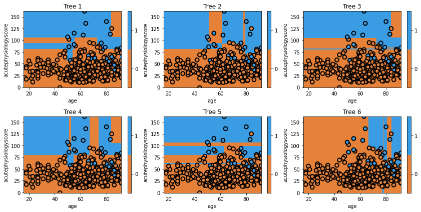

```{r, echo=FALSE, message=FALSE, warnings=FALSE}
library(randomForest)
library(ggplot2)
library(partykit)
library(tidyverse)
library(caret)
library(dplyr)
library(rafalib)
```

```{r custom_plot, echo=FALSE}
# Custom plotting function
# This function is reused in each workshop
plot_model_pred_2d <- function(model, dataset, feature1, feature2, target, title, min_f1, max_f1, min_f2, max_f2) {
  # Ensure dataset is a data frame
  if (!is.data.frame(dataset)) {
    dataset <- as.data.frame(dataset)
  }
  
  # Create a grid over the feature space
  grid <- expand.grid(
    feature1 = seq(min_f1, max_f1, length.out = 100),
    feature2 = seq(min_f2, max_f2, length.out = 100)
  )
  
  # Set correct column names for grid
  colnames(grid) <- c(feature1, feature2)
  
  # Predict class for each point in the grid using the model
  grid$predicted_class <- predict(model, newdata = grid, type = "class")
  
  plot <- ggplot() +
    geom_tile(data = grid, aes(x = .data[[feature2]], y = .data[[feature1]], fill = .data$predicted_class), alpha = 0.3) +
    geom_point(data = dataset, aes(x = .data[[feature2]], y = .data[[feature1]], color = .data[[target]]), size = 2) +
    labs(title = title, x = feature2, y = feature1) +
    scale_fill_manual(values = c("red", "blue"), name = "Predicted Class") +
    scale_color_manual(values = c("red", "blue"), name = "Actual Class") +
    theme_minimal()
  
    return(plot)
}
```

```{r load_data}
# Load the data
cohort <- read.csv("./eicu_cohort_trees.csv")
features = c("acutephysiologyscore", "age")
cohort$actualhospitalmortality = as.factor(cohort$actualhospitalmortality)

# adaboost implementation requires outcome as -1/1
cohort$boosted_mortality <- ifelse(cohort$actualhospitalmortality == levels(cohort$actualhospitalmortality)[1], -1, 1)

# Split the data into training and testing sets
set.seed(42)
train_index <- createDataPartition(cohort$acutephysiologyscore, times = 1, p = 0.7, list = FALSE)
train_set <- cohort[train_index, ]
test_set <- cohort[-train_index, ]
```

In the previous example, we used bagging to randomly resample our data to generate "new" datasets. The Random Forest takes this one step further: instead of just resampling our data, we also select only a fraction of the features to include.

It turns out that this subselection tends to improve the performance of our models. The odds of an individual being very good or very bad is higher (i.e. the variance of the trees is increased), and this ends up giving us a final model with better overall performance (lower bias).

Let's train the model.



## Question

1) When specifying the model, we set `max_features` to `1`. All of the trees make decisions using both features, so it appears that our model is not respecting the argument.  What is the explanation for this inconsistency?  

2) What would you expect to see with a `max_features` of `1` AND a `max_depth` of `1`?  

3) Repeat the plots with the new argument to check your answer to b. What do you see with respect to Age? Why?  

## Solution

1) If it was true that setting `max_features=1` as an argument led to trees with a single variable, we would not see the trees in our figure (which all make decisions based on both features). The explanation is that features are being limited at each split, not at the model level.  

2) Setting `max_features` to `1` limits our trees to a single split. We now see two sets of trees, some restricted to Acute Physiology Score and some restricted to Age.  

3) Our trees decided against splitting on Age. The model was unable to find a single Age that led to improvement (based on its optimisation criteria).  

Let's look at final model's decision surface.

```{r}
mdl <- randomForest(actualhospitalmortality ~ age + acutephysiologyscore,
                    data = train_set, ntree = 6, mtry = 1)

# plot the final prediction
title = 'Random forest (final decision surface)'
plot <- plot_model_pred_2d(mdl, train_set, "acutephysiologyscore", "age", "actualhospitalmortality",
                           title, 0, 200, 0, 100)
print(plot)
```

Again, the visualization doesn't really show us the power of Random Forests, but we'll quantitatively evaluate them soon enough.

## Key points

- With Random Forest models, we resample data and use subsets of features.

- Random Forest are powerful predictive models.

