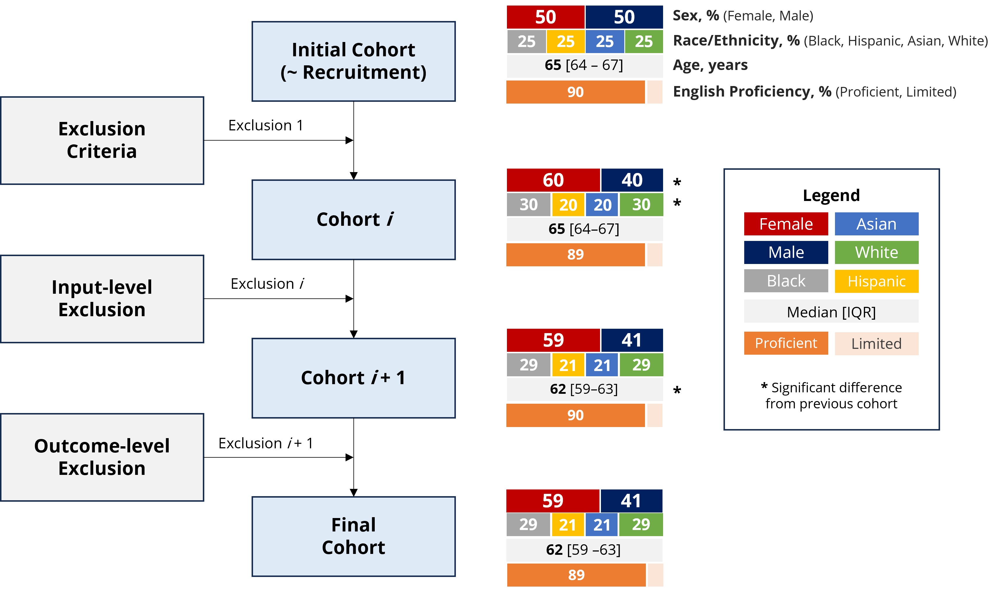
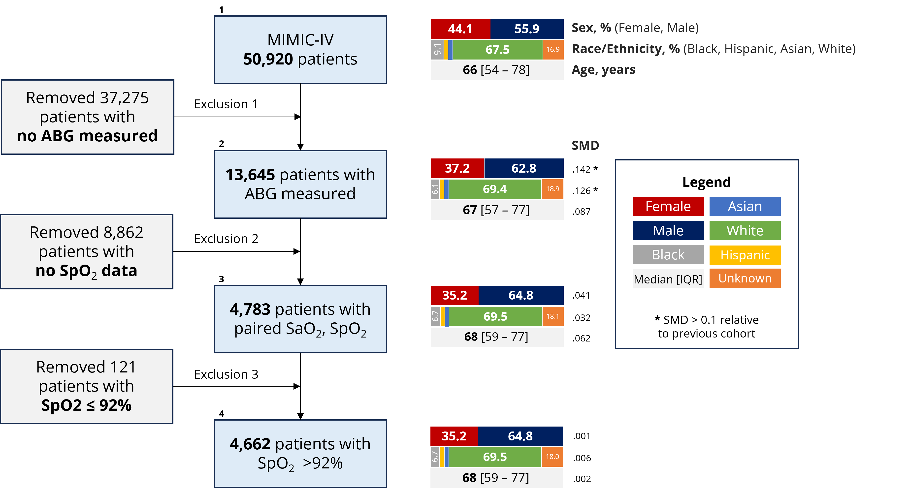
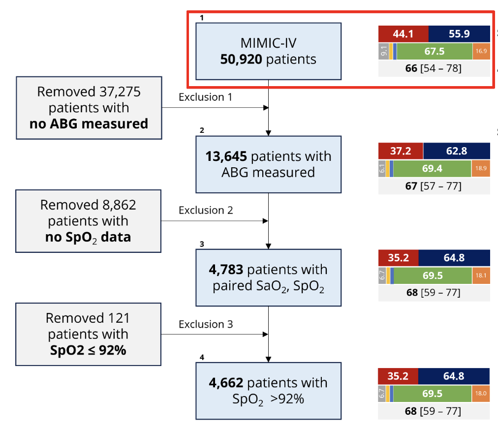
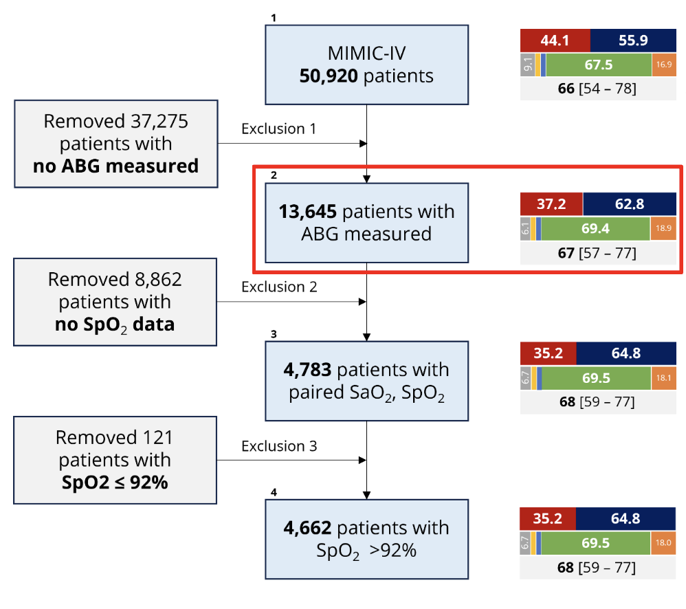
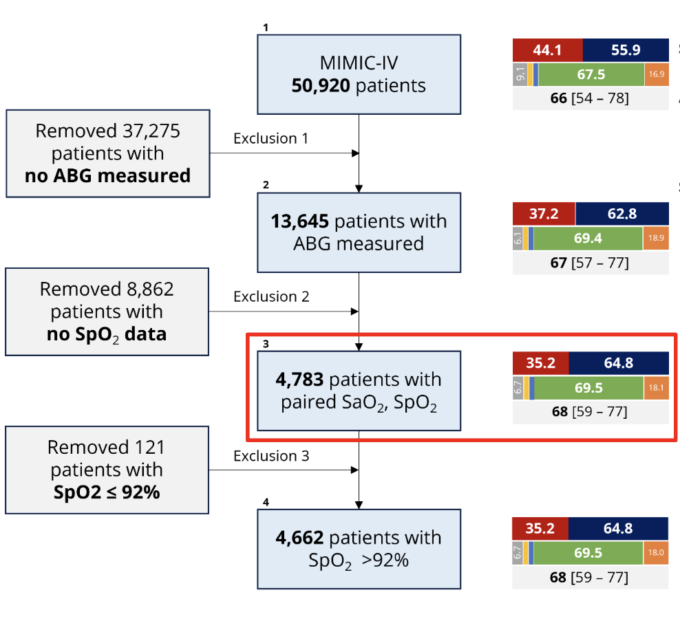

```{r setup, include=FALSE}
knitr::opts_chunk$set(warning = FALSE, message = FALSE)
```
## 1. Introduction

The purpose of this workshop is to explore whether systematic biases occur in healthcare outcomes for different sociodemographic subgroups.

First, we present a systematic approach that can be used to build a standardized participant flow diagram.

Then, we provide a case study to demonstrate how this diagram can be implemented in practice.

Our case study is based on a cohort created for developing a Machine Learning (ML) model to predict future hidden hypoxemia. (We are not building an ML model here! 😊)

Hidden hypoxemia occurs when patients have low oxygen levels in their blood (i.e., below 88%), but this condition goes undetected by pulse oximeters due to documented biases in medical devices, particularly for patients with darker skin tones.

Our analysis focuses on comparing blood oxygen levels as measured by SaO2 from Arterial Blood Gas (ABG) tests versus SpO2 measurements from pulse oximetry devices.

The approach emphasizes tracking changes in sample composition as a study progresses.

By showing the distribution of sociodemographic features across different stages of the process of building our final cohort for the analysis, we aim to identify and highlight various types of biases and inequities.

Why is it important to monitor changes (decreases) in the percentage of some subgroups throughout a study?

A decrease in the representation of any subgroup in a study can compromise its external validity, making the conclusions less applicable to the entire population it aims to represent.

This is why it is essential to monitor representativeness throughout all stages of a study, especially when the goal is to apply the results equitably and fairly to a diverse population.

<br>
By the end of the workshop, you should be able to answer questions like those:

- Has this dataset been pre-processed in such a way that it could affect the study sample?

- What patient characteristics, demographic (age, sex, race) are available in this dataset?

- How might the distribution of these characteristics change throughout each step of this study’s sample selection process, including after the application of exclusion criteria?

<br>

This workshop is inspired by the paper by Ellen et al., 2024, shown in the image below. We have reproduced the participant flow diagram template used by the authors and converted the original code from Python to R.

<hr />

{width=50%}

### Links for Paper and GitHub Repository

<br>
You can find the paper here: https://www.sciencedirect.com/science/article/abs/pii/S1532046424000492
<br><br>

The original code that produces the case study is open-source and it's available on GitHub (in Python): 

{width=8%} https://github.com/joamats/mit-flow-diagram
<br><br>

### Participant Flow Diagrams

### Aims

- To better understand and mitigate potential biases in AI;

- To enhance transparency and promotion of health equity by:

  - Tracking the number of participants excluded at each phase of any study;
  
  - Reporting changes in sociodemographic and clinical characteristics of the sample that are relevant to the study question.
  
### Flow Diagram Template

<br>

In [1], the authors propose a systematic approach to constructing a participant flow diagram as shown below:

<br><br>

{width=80%}

<br>

### {width=9%} Spoiler alert! Flow Diagram Case Study

<br>
In this workshop, we use this template as a reference for the case study example we are building,  which can be summarized below:
<br><br>

{width=80%}
  
<br>  
  
## 2. Case Study: Generating Participant Flow Diagrams using MIMIC 
<hr />

The following R script provides a comprehensive workflow for generating participant flow diagrams to understand the progression and characteristics of study cohorts.

### Data used in this workshop

In this workshop, we use the MIMIC-IV Clinical Database Demo (Version: 2.2) which can be found in this link: https://physionet.org/content/mimic-iv-demo/2.2/.

Note: For those interested in running the following code and reproduce the results using the full MIMIC-IV dataset, please refer to Section 7 of this document.

## {width=6%} 3. Hands on Bias! Let's get started coding! 
<hr />

These libraries are essential for data manipulation (dplyr, readr, data.table), date-time operations (lubridate), creating tables (tableone, htmlTable), plotting (ggplot2, gridExtra), and knitting R markdown documents (knitr).

```{r}
# Function to install and load necessary libraries
install_and_load <- function(libraries) {
  for (lib in libraries) {
    if (!requireNamespace(lib, quietly = TRUE)) {
      install.packages(lib)
    }
    library(lib, character.only = TRUE)
  }
}

# List of required libraries
libraries <- c(
  "dplyr", "readr", "tableone", "knitr", 
  "ggplot2", "htmlTable", "data.table", 
  "tidyr", "gridExtra", "lubridate"
)

# Install and load all necessary libraries
install_and_load(libraries)
```

### Initialize Data Structures used throghout the code

Two lists patient_samples_mimic_iv_list and patient_data_with_demographics_dfs are initialized to store data at various stages of the workflow.

```{r}

# Define a list to store dataframes, where each dataframe represents a cohort of patient samples from the MIMIC-IV dataset
patient_samples_mimic_iv_list <- list()

# Define a list of dataframes containing patient data focused on demographic information, derived from the dataframes in the patient_samples_mimic_iv_list
patient_data_with_demographics_dfs <- list()
```
<br>

```{r}
# Set the working directory if needed. Replace the file path in the setwd function with your own.
# Your file path should be the path where the current script named script_create_table_one.Rmd is saved.

# Example:
# file_path <- "~/Work/mit/bst209_2024/mimic_iv_demo_verson_equiflow_workshop/src"
# setwd(file_path)
```

<br>
Now we can walk through some examples that demonstrate how biases can present in different stages of a study, from recruitment to exclusion criteria to input-level omissions to participant attrition during a study.

<br>

### Step 1: Load, Preprocess, and Visualize data for the Original dataset containing all patients (Step 1/4)
<hr />

{width=60%}

### Get Original dataset

Let’s begin by loading our original dataset:

The dataset original.csv is loaded into the mimic_iv_pat dataframe.

```{r}
# Step 1.1 - Load Original dataset
mimic_iv_pat <- read_csv('./../data/demo_original.csv', show_col_types = FALSE)
kable(head(mimic_iv_pat), format = "pipe",  padding = 2)
```

### Preprocess Original dataset

Now we begin preprocessing the dataset by mapping race/ethnicity values using the definitions-mimic-iv.csv file.

```{r}
# Step 1.2 - Preprocess Original dataset
mimic_iv_map <- read_csv('./../data/definitions-mimic-iv.csv', show_col_types = FALSE)
kable(head(mimic_iv_map), format = "pipe",  padding = 2)

# Map race_ethnicity values based on definitions
mapping_series <- setNames(mimic_iv_map$mapping, mimic_iv_map$original)
mimic_iv_pat$race_ethnicity <- mapping_series[mimic_iv_pat$race_ethnicity]
kable(head(mimic_iv_pat), format = "pipe",  padding = 2)
```

### Group and Select Data

Next, we group the dataset and select the first record for each subject. Relevant columns are then added to the patient_data_with_demographics_dfs list.

```{r}
# Group by subject_id and select the first record for each subject
mimic_iv_pat <- mimic_iv_pat %>% group_by(subject_id) %>% slice(1)

# Select relevant columns and add to patient_data_with_demographics_dfs list
patient_data_with_demographics_dfs[[1]] <- mimic_iv_pat %>% select(subject_id, race_ethnicity, sex_female, admission_age)
kable(head(patient_data_with_demographics_dfs[[1]]), format = "pipe",  padding = 2)
```

### Visualize Distribution for the Original Dataset

Let's check how our cohort distribution looks at the beginning of the case study.

### Define Visualization Function

The following function generates a plot that visualizes the demographic distribution of race/ethnicity and gender across different cohorts in the study. The function follows these steps:

- First, it iterates over each dataframe in the patient_data_with_demographics_dfs list. For each dataframe, it calculates the percentage of patients in each racial and gender group. 

- After calculating the percentages, it creates data frames (race_ethnicity_data and gender_data) that hold the calculated percentages for race/ethnicity and gender, respectively, for all cohorts;

- The function then converts this data into a long format suitable for plotting. It combines the race/ethnicity and gender data into a single dataframe called combined_data.

- Finally, it uses the ggplot2 package to create a bar plot showing the distribution of race/ethnicity and gender across all cohorts.

```{r}
visualize_cohort <- function(patient_data_with_demographics_dfs) {
  if (length(patient_data_with_demographics_dfs) > 0) {
    
    # Initialize vectors to store the percentages for each race across all cohorts
    black_percentages <- c()
    asian_percentages <- c()
    hispanic_percentages <- c()
    unknown_percentages <- c()
    white_percentages <- c()
    
    # Loop through each cohort in the patient_data_with_demographics_dfs list
    for (i in 1:length(patient_data_with_demographics_dfs)) {
      cohort <- patient_data_with_demographics_dfs[[i]]
      
      # Calculate total patients in the cohort
      total_patients <- nrow(cohort)
      
      # Calculate the number and percentage of Black patients
      black_patients <- nrow(cohort %>% filter(race_ethnicity == "Black"))
      percent_black <- (black_patients / total_patients) * 100
      black_percentages <- c(black_percentages, percent_black)
      
      # Calculate the number and percentage of Asian patients
      asian_patients <- nrow(cohort %>% filter(race_ethnicity == "Asian"))
      percent_asian <- (asian_patients / total_patients) * 100
      asian_percentages <- c(asian_percentages, percent_asian)
      
      # Calculate the number and percentage of Hispanic patients
      hispanic_patients <- nrow(cohort %>% filter(race_ethnicity == "Hispanic OR Latino"))
      percent_hispanic <- (hispanic_patients / total_patients) * 100
      hispanic_percentages <- c(hispanic_percentages, percent_hispanic)
      
      # Calculate the number and percentage of White patients
      white_patients <- nrow(cohort %>% filter(race_ethnicity == "White"))
      percent_white <- (white_patients / total_patients) * 100
      white_percentages <- c(white_percentages, percent_white)
      
      # Calculate the number and percentage of Unknown patients
      unknown_patients <- nrow(cohort %>% filter(race_ethnicity == "Unknown"))
      percent_unknown <- (unknown_patients / total_patients) * 100
      unknown_percentages <- c(unknown_percentages, percent_unknown)
    }
    
    # Create the data frame similar to race_ethnicity_data
    race_ethnicity_data <- data.frame(
      Black = black_percentages,
      Asian = asian_percentages,
      Hispanic = hispanic_percentages,
      Unknown = unknown_percentages,
      White = white_percentages
    )
    
    # Print the race_ethnicity_data to check the result
    print(race_ethnicity_data)
    
    # Initialize vectors to store the percentages for male and female across all cohorts
    female_percentages <- c()
    male_percentages <- c()
    
    # Loop through each cohort in the patient_data_with_demographics_dfs list
    for (i in 1:length(patient_data_with_demographics_dfs)) {
      cohort <- patient_data_with_demographics_dfs[[i]]
      
      # Calculate total patients in the cohort
      total_patients <- nrow(cohort)
      
      # Calculate the number and percentage of female patients
      female_patients <- nrow(cohort %>% filter(sex_female == 1))
      percent_female <- (female_patients / total_patients) * 100
      female_percentages <- c(female_percentages, percent_female)
      
      # Calculate the number and percentage of male patients
      male_patients <- nrow(cohort %>% filter(sex_female == 0))
      percent_male <- (male_patients / total_patients) * 100
      male_percentages <- c(male_percentages, percent_male)
    }
    
    # Create the data frame similar to gender_data
    gender_data <- data.frame(
      female = female_percentages,
      male = male_percentages
    )

    # Print the gender_data to check the result
    print(gender_data)
    
    # Use a loop to generate long format data for race and gender
    combined_data <- bind_rows(lapply(1:length(patient_data_with_demographics_dfs), function(i) {
      racial_long <- race_ethnicity_data[i, ] %>%
        mutate(Group = paste('Race', paste0('Cohort ', i))) %>%
        pivot_longer(cols = -Group, names_to = 'Category', values_to = 'Value')
      
      gender_long <- gender_data[i, ] %>%
        mutate(Group = paste('Gender', paste0('Cohort ', i))) %>%
        pivot_longer(cols = -Group, names_to = 'Category', values_to = 'Value')
      
      bind_rows(racial_long, gender_long)
    }))
    
    # Define custom colors
    custom_colors <- c("Black" = "#1f78b4", "Asian" = "#33a02c", "Hispanic" = "#e31a1c", 
                       "Unknown" = "#ff7f00", "White" = "#6a3d9a", 
                       "female" = "#fdbf6f", "male" = "#b2df8a")
    
    # Plot
    ggplot(combined_data, aes(x = Group, y = Value, fill = Category)) +
      geom_bar(stat = "identity", position = "fill", width = 0.8) +  
      coord_flip() +
      scale_y_continuous(labels = scales::percent) +
      labs(x = "Group", y = "Proportion", fill = "Category") +
      scale_fill_manual(values = custom_colors) +
      ggtitle("Cohort Distribution") + 
      theme_minimal(base_family = "Helvetica") +
      theme(
        axis.text.x = element_text(angle = 0, hjust = 1, size = 10),
        axis.text.y = element_text(size = 9),
        legend.position = "bottom",
        legend.text = element_text(size = 10),
        legend.title = element_text(size = 10),
        panel.grid.major = element_line(size = 0.),
        panel.grid.minor = element_blank(),
        strip.text = element_text(size = 12)
      )
    
  } else {
    print("The patient_data_with_demographics_dfs list is empty. Please load the data before running the analysis.")
  }
}
```
Next, the visualize_cohort function is called with the patient_data_with_demographics_dfs list as its input - which now contain only the first cohort. 

It generates a visual representation of the demographic distribution of race/ethnicity and gender across the different cohorts in the study.

The plot displays the proportion of each category within the "Race" and "Gender" groups for each cohort. The bars are filled based on the category.

```{r}
# Step 1.3 - Visualize cohort distribution for "Original" dataset
visualize_cohort(patient_data_with_demographics_dfs)
nrow(patient_data_with_demographics_dfs[[1]])
```

<br>

### Step 2: Load, Preprocess, and Visualize Data data for the dataset ABGs (which excludes missing ABGs data) (Step 2/4)
<hr />
{width=60%}

### Get ABGs dataset

The dataset abgs.csv is loaded into mimic_iv_abgs.

```{r}
# Step 2.1 - Load ABGs dataset
mimic_iv_abgs <- read_csv('./../data/demo_abgs.csv', show_col_types = FALSE)
```

### Preprocess ABGs dataset

The next step involves preprocessing the ABGs dataset. 

- We rename the column indicating the chart time of ABGs from charttime to charttime_abgs for clarity;

- We convert the column to date-time format;

- Finally, we filter the dataset to exclude rows with any missing values in critical columns.

The following code demonstrates this process:

```{r}
# Step 2.2 - Preprocess ABGs dataset
mimic_iv_abgs <- mimic_iv_abgs %>%
  rename(charttime_abgs = charttime)

mimic_iv_abgs$charttime_abgs <- ymd_hms(mimic_iv_abgs$charttime_abgs)
patient_samples_mimic_iv_list[['abgs']] <- mimic_iv_abgs %>%
  mutate(across(c(subject_id, hadm_id, pH, pCO2, pO2, SaO2), as.numeric)) %>%
  filter(!is.na(subject_id) & !is.na(hadm_id) & !is.na(charttime_abgs) & !is.na(pH) & !is.na(pCO2) & !is.na(pO2) & !is.na(SaO2))
nrow(patient_samples_mimic_iv_list[['abgs']])
```

Next, we merge the ABGs data with patient data using hadm_id, group by subject_id, and retain the first record for each subject. 

```{r}
# Merge with patient data and group by subject_id
mimic_iv_pat_abgs <- left_join(patient_samples_mimic_iv_list[['abgs']], mimic_iv_pat, by = "hadm_id") %>%
  rename(subject_id = subject_id.x) %>%
  select(-subject_id.y) %>%
  filter(!is.na(race_ethnicity) & !is.na(admission_age) & !is.na(sex_female)) %>%
  group_by(subject_id) %>%
  slice(1)
```

The processed ABGs data is then added to the patient_data_with_demographics_dfs list for further analysis.

```{r}
# Add processed ABGs data to patient_data_with_demographics_dfs list
patient_data_with_demographics_dfs[[2]] <- mimic_iv_pat_abgs %>% select(subject_id, race_ethnicity, sex_female, admission_age)
kable(head(patient_data_with_demographics_dfs[[2]]), format = "pipe",  padding = 2)
```

### Visualize cohort distribution for ABGs dataset

The visualize_cohort function is called to plot the cohort distribution using the patient_data_with_demographics_dfs list, which now includes both Original dataset and ABGs dataset.

```{r}
# Step 2.3 - Visualize cohort distribution for "ABGs" dataset
visualize_cohort(patient_data_with_demographics_dfs)
nrow(patient_data_with_demographics_dfs[[2]])
```

Observe changes in cohort composition

<br>

### Step 3: Load, Preprocess, and Visualize Data for the Vitals dataset (which excludes patients with missing SPO2) (Step 3/4)
<hr />
{width=60%}

### Get Vitals dataset

The vitals.csv dataset is loaded into mimic_iv_vitals.

```{r}
# Step 3.1 - Get Vitals dataset
# Load Vitals dataset
mimic_iv_vitals <- read.csv('./../data/demo_vitals.csv')
```

### Preprocess Vitals dataset

```{r}
# Step 3.2 - Preprocess Vitals dataset
mimic_iv_vitals <- mimic_iv_vitals %>%
  rename(charttime_vitals = charttime)

mimic_iv_vitals$charttime_vitals <- ymd_hms(mimic_iv_vitals$charttime_vitals)
patient_samples_mimic_iv_list$vitals <- mimic_iv_vitals %>%
  mutate(across(c(subject_id, hadm_id, stay_id), as.numeric)) %>%
  filter(!is.na(subject_id) & !is.na(hadm_id) & !is.na(charttime_vitals) & !is.na(O2.saturation.pulseoxymetry)) %>%
  rename(SpO2 = O2.saturation.pulseoxymetry)

# Filter vitals data with SpO2 and merge with "SPO2 paired" subject_ids
patient_samples_mimic_iv_list$vitals_withSpO2 <- patient_samples_mimic_iv_list$vitals %>%
  filter(!is.na(SpO2))

patient_samples_mimic_iv_list$vitals_withSpO2_SaO2 <- patient_samples_mimic_iv_list$vitals %>%
  filter(!is.na(SpO2) & subject_id %in% patient_samples_mimic_iv_list$abgs$subject_id)
```

Here, we use the data.table package to efficiently handle large datasets and foverlaps function to join datasets based on overlapping time intervals.

```{r}
# Convert datasets to data.table
patient_samples_mimic_iv_list$abgs <- as.data.table(patient_samples_mimic_iv_list$abgs)
patient_samples_mimic_iv_list$vitals_withSpO2_SaO2 <- as.data.table(patient_samples_mimic_iv_list$vitals_withSpO2_SaO2)

# Time intervals are defined for each observation in the ABGs dataset
# Add start and end time columns
patient_samples_mimic_iv_list$abgs[, `:=`(start = charttime_abgs - minutes(5), end = charttime_abgs)]
patient_samples_mimic_iv_list$vitals_withSpO2_SaO2[, `:=`(start = charttime_vitals, end = charttime_vitals)]

# Set keys for data.tables for efficient overlapping joins
setkey(patient_samples_mimic_iv_list$abgs, hadm_id, start, end)
setkey(patient_samples_mimic_iv_list$vitals_withSpO2_SaO2, hadm_id, start, end)

# Perform asof join using foverlaps
mimic_iv_ABG_SpO2 <- foverlaps(
  patient_samples_mimic_iv_list$abgs, 
  patient_samples_mimic_iv_list$vitals_withSpO2_SaO2, 
  by.x = c("hadm_id", "start", "end"), 
  by.y = c("hadm_id", "start", "end"),
  type = "any"
)
```

Select and Rename Columns for clarity and consistency.

```{r}
# Select and rename relevant columns
mimic_iv_ABG_SpO2 <- mimic_iv_ABG_SpO2[, .(
  subject_id = i.subject_id, 
  hadm_id = hadm_id, 
  stay_id = stay_id, 
  SaO2_timestamp = charttime_abgs, 
  SpO2_timestamp = charttime_vitals, 
  pH = pH, 
  pCO2 = pCO2, 
  pO2 = pO2, 
  SaO2 = SaO2, 
  SpO2 = SpO2
)]
```

Calculate Time Differences and Clean Data.

```{r}
# Calculate the time difference between SpO2 and SaO2 measurements
mimic_iv_ABG_SpO2[, delta_SpO2 := as.numeric(difftime(SpO2_timestamp, SaO2_timestamp, units = "mins"))]

# Remove records without SpO2_timestamp
mimic_iv_ABG_SpO2 <- mimic_iv_ABG_SpO2[!is.na(SpO2_timestamp)]
```

The time difference between SpO2 and SaO2 measurements is calculated.

Records without SpO2 timestamps are removed to ensure data quality.

Next, we merge Resulting pairs with patient data.

```{r}
# Merge resulting pairs with patient data and store specific columns in dataframes
mimic_iv_pairs_pats <- left_join(mimic_iv_ABG_SpO2, mimic_iv_pat, by = "subject_id")
mimic_iv_pairs_pats <- mimic_iv_pairs_pats %>% group_by(subject_id) %>% slice(1)

# Relevant columns are selected and stored in patient_data_with_demographics_dfs
patient_data_with_demographics_dfs[[3]] <- mimic_iv_pairs_pats %>% select(subject_id, race_ethnicity, sex_female, admission_age)
kable(head(patient_data_with_demographics_dfs[[3]]), format = "pipe",  padding = 2)
```

### Visualize Distribution for Vitals Dataset

```{r}
# Step 3.3 - Visualize cohort distribution for Vitals dataset
visualize_cohort(patient_data_with_demographics_dfs)
nrow(patient_data_with_demographics_dfs[[3]])
```

The visualize_cohort function is called to plot the cohort distribution using the patient_data_with_demographics_dfs list, which now includes Original, ABGs, and Vitals datasets.

<br>

### Step 4: Load, Preprocess, and Visualize data for the "SpO2 > 92" dataset (which excludes patients who doesn't have SpO2 > 92 (Step 4/4)
<hr />
{width=60%}

### Get SpO2 >= 92 dataset
```{r}
# Step 4.1 - Filter pairs with SpO2 >= 92
mimic_iv_final <- mimic_iv_ABG_SpO2 %>% filter(SpO2 >= 92)
```

### Preprocess SpO2 > 92 dataset

Next, we filter and merge Pairs with SpO2 >= 92 with patient data.

```{r}
# Step 4.2 - Preprocess SpO2 >= 92 dataset
# Merge with patient data and store specific columns in dataframes
mimic_iv_final_pats <- left_join(mimic_iv_final, mimic_iv_pat, by = "subject_id")
mimic_iv_final_pats <- mimic_iv_final_pats %>% group_by(subject_id) %>% slice(1)

# Relevant columns are selected and stored in patient_data_with_demographics_dfs
patient_data_with_demographics_dfs[[4]] <- mimic_iv_final_pats %>% select(subject_id, race_ethnicity, sex_female, admission_age)
kable(head(patient_data_with_demographics_dfs[[4]]), format = "pipe",  padding = 2)
```

### Visualize cohort distribution for SpO2 >= 92 dataset

The visualize_cohort function is called to plot the cohort distribution using the patient_data_with_demographics_dfs list, which now contains all four datasets.

```{r}
# Step 4.3 - Visualize cohort distribution for SpO2 >= 92 dataset
visualize_cohort(patient_data_with_demographics_dfs)
nrow(patient_data_with_demographics_dfs[[4]])
```

### Datasets Comparison

### Let's build our TableOne, which shows descriptive analysis of sociodemgraphics across all datasets

```{r}
preprocess_cohorts <- function(dfs) {
  # Fill missing race_ethnicity values with 'Unknown'
  dfs$race_ethnicity[is.na(dfs$race_ethnicity)] <- 'Unknown'
  
  # Map race_ethnicity values to specific categories
  dfs$race_ethnicity <- recode(dfs$race_ethnicity,
                                   'American Indian / Alaska Native' = 'Unknown',
                                   'More Than One Race' = 'Unknown',
                                   'Native Hawaiian / Pacific Islander' = 'Unknown',
                                   'White' = 'White',
                                   'Asian' = 'Asian',
                                   'Hispanic OR Latino' = 'Hispanic OR Latino',
                                   'Black' = 'Black',
                                   'Unknown' = 'Unknown')
  
  # Filter DataFrame to ensure all necessary columns are not null
  dfs <- dfs %>%
    filter(!is.na(race_ethnicity) & !is.na(admission_age) & !is.na(sex_female)) %>%
    ungroup()
  
  return(dfs)
}
```

The preprocess_cohorts function fills missing values, maps race/ethnicity categories, and filters necessary columns.

```{r}
merge_datasets <- function(patient_data_with_demographics_dfs) {
  # Merge all dataframes in the patient_data_with_demographics_dfs list
  dfs <- bind_rows(patient_data_with_demographics_dfs, .id = "cohort")
  
  # Preprocess final dataset All_cohorts
  dfs <- preprocess_cohorts(dfs)
  
  return(dfs)
}
```

The merge_datasets function merges all dataframes in the patient_data_with_demographics_dfs list and preprocesses the final dataset.

```{r}
dfs_cohort1_cohort2_cohort3_cohort4 <- merge_datasets(patient_data_with_demographics_dfs)
```

Preprocess all dataframes in the patient_data_with_demographics_dfs list.

```{r}
dfs_cohort1_cohort2_cohort3_cohort4 <- preprocess_cohorts(dfs_cohort1_cohort2_cohort3_cohort4)
```

fefine a function named generate_tableone to generate a summary table (TableOne) for the merged datasets

```{r}

# Define function to generate TableOne
generate_tableone <- function(all_dfs, file_name) {
  # Define categorical and non-normal variables
  categ <- c('race_ethnicity', 'sex_female')
  nonnormal <- c('admission_age')
  
  # Generate TableOne
  table <- CreateTableOne(data = all_dfs, vars = c(categ, nonnormal), factorVars = categ, strata = 'cohort')
  
  # Convert the table to HTML format
  table_html <- print(table, quote = FALSE, noSpaces = TRUE, printToggle = FALSE)
  
  # Save the HTML table to a file
  html_table <- htmlTable::htmlTable(table_html)
  write(html_table, file = file_name)
  
  # Print the table using kableone
  kableone(table)
}
```

### Compare cohort distributions 

```{r}
generate_tableone(dfs_cohort1_cohort2_cohort3_cohort4, './../data/table_one.html')
```

The table is saved as an HTML file and displayed using kableone.

<br>

## 4. Discussion
<hr />

In this workshop, we demonstrated the creation of a participant flow diagram to understand how changes in cohort composition at different stages and across different sociodemographic subgroups can introduce bias in AI models.

These diagrams help us identify potential biases and ensure the representativeness of study findings.

We can use such tools to ensure that AI models are trained and validated on representative data, thereby enhancing fairness and equity.

<br>

## 5. Conclusion
<hr />

While the process of creating Participant flow diagrams cannot mitigate bias or solve data issues on its own, it is crucial for spotting data issues and biases that can propagate into algorithms. 

It also helps us become more aware of how, for example, the exclusion of particular groups from the cohort can affect the representativeness of our data.

Therefore, this tool can be used to increase transparency, identify biases, and promote equity in ML models.

<br>

## 6. {width=40%}

Change the script (in Steps 1-4) to incorporate a new sociodemographic variable (e.g., age, English proficiency) and try to understand how the distribution of this new variable changes throughout the steps.

Tip: Ask your mentors for assistance if needed! {width=2%}

## 7. Data Access Guidelines

For those who wish to build the participant flow diagram based on the MIMIC-IV version 2.2 dataset (https://physionet.org/content/mimiciv/2.2/), you can download all three datasets used in this example from BigQuery using the queries below:

### Getting Data from the Source with SQL Queries 

For reference, the SQL queries used to extract the datasets are outlined below. 

Briefly, the first query:

- `SELECT` subject_id, hadm_id, stay_id, gender, race, admission_age
- `FROM` the icustay_detail table

```sql
SELECT DISTINCT
    icu.subject_id
  , icu.hadm_id
  , icu.stay_id
  , CASE WHEN icu.gender = "F" THEN 1 ELSE 0 END AS sex_female
  , icu.race AS race_ethnicity
  , icu.admission_age

-- ICU stays
FROM physionet-data.mimiciv_derived.icustay_detail
AS icu
```

Observe that there is no "WHERE" clause, which means that it retrieves data from all patients.


The second query:

- `SELECT` subject_id, hadm_id, charttime, and Blood Gas information (pH, pCO2, pO2, Oxygen Saturation, Carboxyhemoglobin, Methemoglobin, Specimen Type)
- `FROM` the labevents and d_labitems tables
- `WHERE` certain conditions are met.

```sql
SELECT *
FROM
(
  SELECT *
  FROM (
    SELECT subject_id, hadm_id, charttime, label, value
    FROM
    (
      -- subquery
        SELECT *
        FROM `physionet-data.mimiciv_hosp.labevents` le
        LEFT JOIN (
          SELECT itemid, label FROM `physionet-data.mimiciv_hosp.d_labitems`
        )  dle2 ON dle2.itemid = le.itemid
        WHERE le.itemid IN (
          SELECT itemid FROM `physionet-data.mimiciv_hosp.d_labitems` WHERE category = "Blood Gas"
          )
    )
  )
  PIVOT (
    ANY_VALUE(value)
    FOR label IN (
      "pH",
      "pCO2",
      "pO2",
      "Oxygen Saturation" as SaO2,
      "Carboxyhemoglobin",
      "Methemoglobin",
      "Specimen Type" as SpecimenType
      )
  )
) pivoted
WHERE
subject_id IS NOT NULL AND hadm_id IS NOT NULL AND pH IS NOT NULL AND pCO2 IS NOT NULL AND SaO2 IS NOT NULL AND SpecimenType IS NOT NULL AND SpecimenType IN ("ART.")
ORDER BY subject_id ASC,  hadm_id ASC, charttime ASC
```


The third query:

- `SELECT` subject_id, hadm_id, stay_id, charttime, and O2 saturation pulseoxymetry
- `FROM` the chartevents and d_items tables
- `WHERE` certain conditions are met.

```sql
Select *
FROM (
----
  SELECT subject_id, hadm_id, stay_id, charttime, di2.label, valuenum
  FROM `physionet-data.mimiciv_icu.chartevents` ce
  LEFT JOIN `physionet-data.mimiciv_icu.d_items` di2 ON di2.itemid = ce.itemid
  WHERE ce.itemid IN (
    -- select temp, HR, BP, O2sat
      SELECT itemid
      FROM `physionet-data.mimiciv_icu.d_items` di
      WHERE (
          (linksto = 'chartevents')
          and
          di.category in ('Respiratory', 'Routine Vital Signs')
          and
          di.label in (
              'O2 saturation pulseoxymetry'
              )
          )
    )

  )
  PIVOT (
    avg(valuenum)
    FOR label IN (
            'O2 saturation pulseoxymetry'
      )

  )
ORDER BY subject_id ASC,  hadm_id ASC, charttime ASC
```

<br><br><br>
