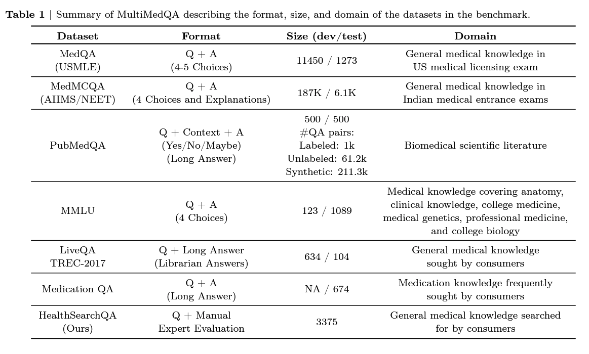

```{r, echo=FALSE, message=FALSE, warnings=FALSE}
library(dplyr)
library(ollamar)
library(ggplot2)
library(knitr)
library(tidyr)
```

While interacting with language models from the command line is convenient, it isn't well-suited to running an analysis. In this workshop, we will connect RMarkdown notebook to a local language model using [Ollamar](https://cran.r-project.org/web/packages/ollamar/ollamar.pdf) and carry out an analyses.

## Test connection

First, let's test our connection to the Ollama server:

```{r, message=TRUE, include=TRUE}
# test connection to Ollama server
connection = test_connection()
```

If you see: "Ollama local server running", you are good to go!

## Load model

We can now start interacting with large language models hosted locally.  First, let's check which (if any) models are already available to us on our local machine: 

```{r, message=FALSE}
list_models()
```

The output lists currently available models (e.g., llama2). You may also see additional details, such as:

- parameter size (e.g., `8B`, indicating that the model has 8 billion parameters);

- quantization level (e.g., `Q4_0`, which refers to the model's weights being quantized to 4 bits).

We can pull down any of the models available in Ollama's library: https://ollama.com/library. Let's get Llama 3:

```{r, message=FALSE}
pull("llama3.1")
```

We can now use the `generate` function to submit our prompt and generate a response:

```{r, message=FALSE}
# generate a response based on a prompt; returns an httr2 response by default
dataframe <- generate("llama3", "tell me a 5-word story", output = "df")
print(dataframe$response)
```

## Expert evaluation

A popular area of research today is to explore the responses generated by large language models, for example in terms of correctness, risk of harm, or presence of bias. 

One way of evaluating a model is through expert review. We prompt our model with questions, and then our expert collaborators evaluate the responses:

Let's explore this approach with some clinical questions:

```{r, message=FALSE}
# Sample questions
questions <- c(
  "What is the most common cause of heart failure? Answer consisely in one paragraph.",
  "What are the side effects of metformin? Answer consisely in one paragraph.",
  "What is the first-line treatment for hypertension? Answer consisely in one paragraph.",
  "What are the symptoms of a stroke? Answer consisely in one paragraph.",
  "What is the mechanism of action of aspirin? Answer consisely in one paragraph."
)
```

How would we answer these questions? 

We now need to loop through these questions to generate a set of responses:

```{r, message=FALSE}
# Initialize a list to store responses
responses <- vector("list", length(questions))

# Loop questions and generate responses
for (i in seq_along(questions)) {
  response <- tryCatch({
    generate("llama3", questions[i], output = "text")
  }, error = function(e) {
    NA  # Return NA if there's an error
  })
  responses[[i]] <- response$response
}

# Combine questions and responses into a data frame
results_df <- data.frame(
  Question = questions,
  Response = unlist(responses)
)

kable(results_df)
```

## Evaluate

Now we assign some kind of score through expert review, e.g.

- Correct
- Partially incorrect
- Incorrect

```{r, message=FALSE}
# Sample evaluation scores (this would be done manually in practice)
evaluation_scores <- c("Correct",
                       "Partially Correct",
                       "Correct",
                       "Correct",
                       "Partially Correct")

# Add the scores to the results data frame
results_df <- results_df %>%
  mutate(Evaluation = evaluation_scores)

# Set the factor levels in the desired order
results_df$Evaluation <- factor(results_df$Evaluation,
                                levels = c("Correct",
                                           "Partially Correct",
                                           "Incorrect"))

kable(results_df)
```

We can then summarize these results, for example with a simple chart:

```{r, message=FALSE}
# Count the occurrences of each evaluation type
evaluation_counts <- results_df %>%
  group_by(Evaluation) %>%
  summarize(Count = n())

# Fill missing levels with zero counts
evaluation_counts <- evaluation_counts %>%
  complete(Evaluation = factor(c("Correct",
                                 "Partially Correct",
                                 "Incorrect")), fill = list(Count = 0))

# Plot the bar chart
ggplot(evaluation_counts, aes(x = Evaluation,
                              y = Count,
                              fill = Evaluation)) +
  geom_bar(stat = "identity") +
  labs(title = "Llama 3 evaluation") +
  theme_minimal()
```

### Discussion

What do you see as the strengths and weaknesses of evaluation through expert review? (e.g. consider subjectivity; inter-expert variability; resource use; scaling; standardization; bias).

## Question-Answer (QA) datasets

Another popular approach for evaluation is with the use of QA datasets, which consist of sets of structured question and answers. The goal is a more standardized, objective measure of a model's performance.

### Examples of QA datasets

- MEDQA: Questions in this dataset are collected from medical board exams in US, Mainland China, and Taiwan. [Sample data](./medqa_100.csv). [Paper](./medqa.pdf).

- MultiMedQA: Combines six existing open question answering datasets spanning professional medical exams, research, and consumer queries; as well as HealthSearchQA, a new free-response dataset of medical questions searched online. [Paper](./multimedqa.pdf).



We can integrate QA datasets into our evaluation workflow to systematically assess our model's performance.

### Load the MEDQA dataset

Let’s load the [medqa.csv](./medqa_100.csv) file containing five examples:

```{r, message=FALSE}
# Load the MEDQA dataset
medqa_data <- read.csv("./medqa_100.csv",
                       stringsAsFactors = FALSE) %>% head(5)

# Display the loaded data
kable(medqa_data)
```

### Generate responses

Now let's loop through the MEDQA questions and generate responses:

```{r, message=FALSE}
# Initialize a list to store responses
responses <- vector("list", length(medqa_data$question))

# Loop through the questions and generate responses
for (i in seq_along(medqa_data$question)) {
  # Modify the prompt to instruct the model to respond with just the letter
  prompt <- paste0(medqa_data$question[i],
                   "\nPlease provide the correct answer as a single letter (A, B, C, or D) without any additional text, choosing from the following 4 options: ", medqa_data$options[i])
  
  response <- tryCatch({
    generate("llama3", prompt, output = "text")
  }, error = function(e) {
    NA  # Return NA if there's an error
  })
  responses[[i]] <- response$response
}

# Combine questions, correct answers, and generated responses into a data frame
qa_results <- data.frame(
  Question = medqa_data$question,
  Options = medqa_data$options,
  CorrectAnswer = medqa_data$answer,
  CorrectAnswerIndex = medqa_data$answer_idx,
  ModelResponse = unlist(responses)
)

kable(qa_results)
```

### Evaluating against QA datasets

After generating responses, we can compare our model’s output to the correct answers provided in the QA dataset. Metrics such as accuracy can be used to quantify performance:

```{r, message=FALSE}
# Calculate accuracy
qa_results <- qa_results %>%
  mutate(
    IsCorrect = ifelse(trimws(ModelResponse) == CorrectAnswerIndex, TRUE, FALSE)
  )

accuracy <- sum(qa_results$IsCorrect) / nrow(qa_results)

# Print accuracy
print(paste("Accuracy:", accuracy * 100, "%"))
```

### Discussion

What are the strengths and weaknesses of this kind of evaluation? Do you think multiple-choice questions are a valid way to assess a language model’s performance in a medical context? How does this compare to the way medical professionals work in practice?

## Future of language models

### Discussion

Considering the rapid advancements in language models, what do you think the future holds for their use in healthcare? Will they replace human professionals in certain tasks, or will they serve as tools to augment human capabilities?

How should we integrate the evaluation of language models into medical practice? Should models be evaluated continuously, and if so, how would this affect their deployment in clinical settings?

